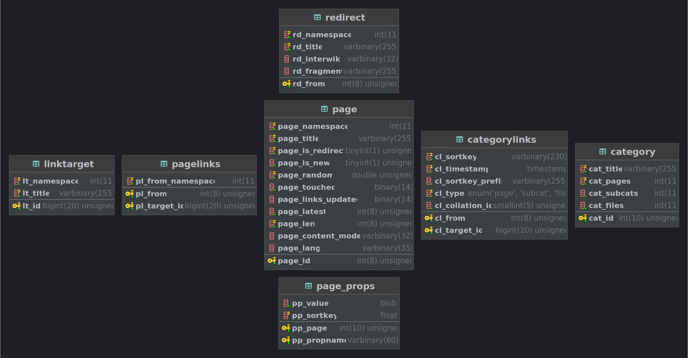

#  Wikigrapher-Generator

Transform Wikipedia into a knowledge graph [https://wikigrapher.com](https://wikigrapher.com)

**TLDR: Wikipedia SQL dumps -> Wikigrapher-Generator -> Wikipedia Neo4j graph**

Explore how Wikipedia pages are connected beneath the surface

---

**Standalone web app for this project is available at [7mza/wikigrapher-slim](https://github.com/7mza/wikigrapher-slim)**

## Overview

Built by transforming Wikipedia SQL dumps (pages, links, redirects, templates, categories) from [relational model](https://www.mediawiki.org/wiki/manual:database_layout)



into a navigable graph


Technically a set of bash scripts to download and clean dumps + python scripts to handle dictionary/set operations and serialize in-memory objects (RAM offloading + snapshotting of processing steps)

---

This project is loosely based on [jwngr/sdow](https://github.com/jwngr/sdow)

It's heavily modified to rely entirely on graph model and [neo4j/apoc](https://github.com/neo4j/apoc) instead of rewriting graph algorithms + introducing support for more Wikipedia node types (redirects, categories, templates ...)

## Local generation

[python <= 3.11](https://github.com/pyenv/pyenv)

bash

```shell
#apt install wget aria2 pigz

chmod +x ./*.sh

(venv)

pip3 install --upgrade pip -r requirements.txt

./clean.sh && ./generate_tsv.sh

# or

./clean.sh && ./generate_tsv.sh --date YYYYMMDD --lang XX
```

**Dumps are released each 01 & 20 of the month, 404/checksum error means dump in progress, wait for a few days or pick a previous date**

**--date YYYYMMDD** represents desired date of [dump](https://dumps.wikimedia.org/enwiki)

- If not provided, will default to latest dump available
- **--date 11111111 will generate an EN dummy dump based on [example.sql](./misc/example.sql) for testing purposes**

**--lang XX** represents desired language of dump

- **EN/AR/FR are tested**
- If not provided, will default to EN

To test another language, enable it in line `en | ar | fr)` in [generate_tsv.sh](./generate_tsv.sh)

**Dump download depends on Wikimedia servers rate limit and graph generation for Wikipedia EN takes around 2h on a 6c/32g/nvme**

## Docker generation

<span style="color:red">Limit generator service RAM and CPU in [compose.yml](./compose.yml)</span>

```shell
docker compose run --remove-orphans --build generator

# or

DUMP_DATE=YYYYMMDD DUMP_LANG=XX docker compose run --remove-orphans --build generator

# using run instead of up for tqdm and aria2 progress indicators
```

```shell
# linux only: change ownership of generated files to current user/group
# not needed for win/mac
sudo chown -R "$(id -u):$(id -g)" ./dump/ ./output/
```

## Neo4j setup

Clean previous neo4j volume when processing a newer dump

```shell
docker volume rm wikigrapher_neo4j_data
```

After successful generation of graph TSVs by previous step

`[INFO] graph generated successfully: Sun Aug 01 08:00:00 2025`

(exit 0 + check [output folder](./output/))

Uncomment neo4j service command line in [compose.yml](./compose.yml) to prevent default db from starting immediately after neo4j server starts

Community version only allows 1 db and prevents importing on a running one

Then

```shell
docker compose --profile neo4j up --build --remove-orphans
```

After container starts and return "not starting database automatically", leave it running, and in a separate terminal (project dir)

```shell
docker compose exec neo4j bash -c "
cd /import && \
neo4j-admin database import full neo4j \
--overwrite-destination --delimiter='\t' --array-delimiter=';' \
--nodes=./pages.header.tsv.gz,./pages.final.tsv.gz \
--nodes=./categories.header.tsv.gz,./categories.final.tsv.gz \
--nodes=./meta.header.tsv.gz,./meta.final.tsv.gz \
--relationships=./redirect_to.header.tsv.gz,./redirect_to.final.tsv.gz \
--relationships=./link_to.header.tsv.gz,./link_to.final.tsv.gz \
--relationships=./belong_to.header.tsv.gz,./belong_to.final.tsv.gz \
--relationships=./contains.header.tsv.gz,./contains.final.tsv.gz \
--verbose"
```

After importing is finished, revert changes of [compose.yml](./compose.yml), stop the previously running neo4j container then `docker compose --profile neo4j up --build --remove-orphans` again, you should be able to connect to neo4j ui at http://localhost:7474/ (login/pwd in [.env](./.env))

### Neo4j text lookup indexes :

Nodes indexes

```sql
CREATE TEXT INDEX index_page_title IF NOT EXISTS FOR (n:page) on (n.title);
CREATE TEXT INDEX index_page_id IF NOT EXISTS FOR (n:page) on (n.pageId);

CREATE TEXT INDEX index_redirect_title IF NOT EXISTS FOR (n:redirect) on (n.title);
CREATE TEXT INDEX index_redirect_id IF NOT EXISTS FOR (n:redirect) on (n.pageId);

CREATE TEXT INDEX index_category_title IF NOT EXISTS FOR (n:category) on (n.title);
CREATE TEXT INDEX index_category_id IF NOT EXISTS FOR (n:category) on (n.categoryId);

CREATE TEXT INDEX index_meta_property IF NOT EXISTS FOR (n:meta) on (n.property);
CREATE TEXT INDEX index_meta_value IF NOT EXISTS FOR (n:meta) on (n.value);
CREATE TEXT INDEX index_meta_id IF NOT EXISTS FOR (n:meta) on (n.metaId);
```

```sql
SHOW INDEXES;
// wait for 100% populationPercent
```

If you want to flag orphans (pages with no incoming or outgoing links)

```sql
CALL apoc.periodic.iterate(
  "MATCH (node:page) RETURN node",
  "WITH node
  WHERE NOT EXISTS ((node)-[:link_to]->())
  AND NOT EXISTS ((node)<-[:link_to|redirect_to]-())
  AND NOT EXISTS ((node)<-[:contains]-(:category {title: 'Redirects_to_Wiktionary'}))
  CREATE (orphan:orphan {
    id: node.pageId,
    title: node.title,
    type: labels(node)[0],
    createdAt: timestamp()
  })
  RETURN orphan",
  {batchSize: 100000, parallel: true}
)
YIELD batches, total
RETURN batches, total

// wait for procedure to finish
```

then orphan indexes

```sql
CREATE TEXT INDEX index_orphan_title IF NOT EXISTS FOR (n:orphan) on (n.title);
CREATE TEXT INDEX index_orphan_type IF NOT EXISTS FOR (n:orphan) on (n.type);
CREATE TEXT INDEX index_orphan_id IF NOT EXISTS FOR (n:orphan) on (n.id);
CREATE TEXT INDEX index_orphan_created IF NOT EXISTS FOR (n:orphan) on (n.createdAt);
```

```sql
SHOW INDEXES;
// wait for 100% populationPercent
```

## Some Neo4j queries

<span style="color:red">neo4j auto escapes special chars before saving</span>

```
L'Avare_(film)            savedAs     L\\'Avare_(film)

Powelliphanta_"Matiri"    savedAs     Powelliphanta_\\\"Matiri\\\"
```


### shortest path between two nodes

```sql
MATCH (source:page|redirect {title: "Albus_Dumbledore"})
MATCH (target:page|redirect {title: "Ubuntu"})
MATCH path = SHORTESTPATH((source)-[:link_to|redirect_to*1..50]->(target))
RETURN path
```

### all shortest paths between two nodes

```sql
MATCH (source:page|redirect {title: "L\\'Avare_(film)"})
MATCH (target:page|redirect {title: "Ubuntu"})
MATCH paths = ALLSHORTESTPATHS((source)-[:link_to|redirect_to*1..50]->(target))
WITH paths, [node IN nodes(paths) | node.title] AS titles
ORDER BY titles
// SKIP 0 LIMIT 10
return paths
```

### all shortest paths between two nodes + consider redirects as target

```sql
MATCH (source:page|redirect {title: "L\\'Avare_(film)"})
MATCH (target:page|redirect {title: "Powelliphanta_\\\"Matiri\\\""})
MATCH (redirects:redirect)-[:redirect_to]->(target)
MATCH paths = allShortestPaths((source)-[:link_to|redirect_to*1..50]->(target))
WITH paths AS tmp, length(paths) AS len, source, redirects
CALL
  apoc.cypher.run(
    "CALL (source, len, redirects, tmp) {
        MATCH paths = ALLSHORTESTPATHS(
          (source)-[:link_to|redirect_to*1.." + len + "]->(redirects)
        )
        RETURN paths
        UNION
        RETURN tmp as paths }
        WITH paths, [node IN nodes(paths) | node.title] AS titles
        ORDER BY titles
        RETURN paths",
    {source: source, redirects: redirects, len: len, tmp:tmp}
  )
YIELD value
WITH DISTINCT value.paths AS paths
// SKIP 0 LIMIT 10
RETURN paths
```

### find orphan nodes

```sql
MATCH (orphan:orphan {type: "page"}) // or "redirect"
RETURN orphan
ORDER BY orphan.title
// SKIP 0 LIMIT 10
```

### all nodes belonging to a category

```sql
MATCH (target:category {title: "The_Lord_of_the_Rings_characters"})
MATCH (node)-[:belong_to]->(target)
RETURN node
ORDER BY node.title
// SKIP 0 LIMIT 10 // carefull, will hang your host
```

### top/bottom N categories

```sql
MATCH (category:category)<-[:belong_to]-()
WITH category, count(*) AS categoryCount
RETURN category.title AS categoryTitle, categoryCount
ORDER BY categoryCount DESC // or ASC for bottom
SKIP 0 LIMIT 3 // carefull, will hang your host
```

## Collaboration & scope

There’s more structured Wikipedia data to be added (revisions, revision authors, ...etc)

Other tools like spark are better for large-scale processing, but the goal here is simplicity:
runs on a personal machine, easy to understand and easy to extend

If you have ideas or want to contribute, feel free to open an issue or PR

## Todo

- Wikipedia templates
- Split sh files
- Unit tests
- Lower RAM needs by moving from dill/pickle to a better way (mmap, hdf5 ...)
- Pgzip not working on py >= 3.12 (dumps are gz and neo4j-admin can only read gz/zip)

## Misc

All links DB are changing according to [https://phabricator.wikimedia.org/T300222](https://phabricator.wikimedia.org/T300222)

Format/lint:

```shell
#apt install shfmt shellcheck

(venv)

pip3 install --upgrade pip -r requirements_dev.txt

isort ./scripts/*.py && black ./scripts/*.py && shfmt -l -w ./*.sh && shellcheck ./*.sh

pylint ./scripts/*.py
```

## License

This project is licensed under the [GNU Affero General Public License v3.0](./LICENSE.txt)

Wikipedia® is a registered trademark of the Wikimedia foundation

This project is independently developed and not affiliated with or endorsed by the Wikimedia foundation
