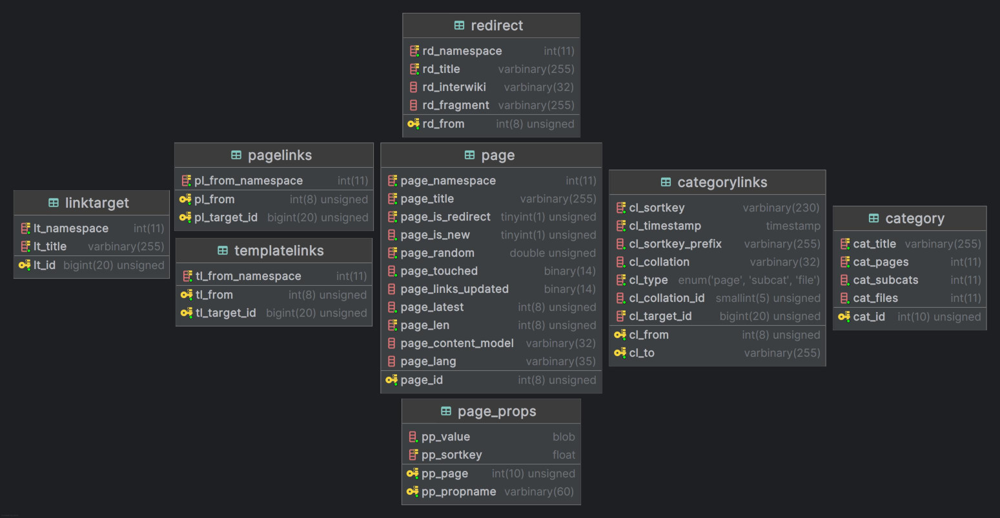
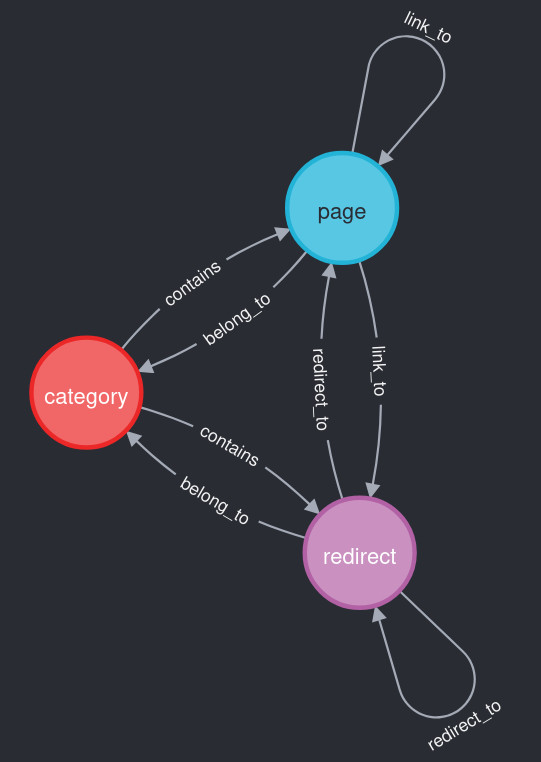

#  wikigrapher-generator

explore wikipedia as a graph [https://wikigrapher.com](https://wikigrapher.com)

## content

- 📚 [overview](#overview)
- 🧰 [reqs](#reqs)
- ⛴ [docker generation](#docker-generation)
- ⚙️ [local generation](#local-generation)
- 🛠 [neo4j setup](#neo4j-setup)
- 🪛 [todo](#todo)
- 💡 [misc](#misc)
- 🪧 [license](#license)

## overview

visualize how wikipedia pages connect using graph model

built by transforming a subset of wikipedia sql dumps (pages, links, redirects, templates, categories) from [relational sql model](https://www.mediawiki.org/wiki/manual:database_layout)



into a navigable graph



technically a set of shell scripts to download and clean wikipedia dumps + python scripts to handle dictionary/set operations and serialize in-memory objects (RAM offloading + snapshotting of processing steps)

**standalone web app exposing the graph generated by this project is available at [7mza/wikigrapher-slim](https://github.com/7mza/wikigrapher-slim)**

---

this project is loosely based on [jwngr/sdow](https://github.com/jwngr/sdow)

it's modified to rely entirely on graph model and [neo4j/apoc](https://github.com/neo4j/apoc) instead of rewriting graph algorithms + introducing support for more Wikipedia node types (redirects, categories, templates ...)

## reqs

[docker](https://docs.docker.com/desktop)

## docker generation

**iconv** can become resource intensive and might hang your system when processing large files

<span style="color:red">limit generator service RAM and CPU in [compose.yml](./compose.yml)</span>

docker will halt [generate_tsv.sh](./generate_tsv.sh) if resource limits are exceeded

```shell
export UID=$(id -u) && export GID=$(id -g)
```

use run instead of up if you want tqdm and aria2 progress indicators

```shell
docker compose run --remove-orphans --build generator

# or

DUMP_DATE=YYYYMMDD DUMP_LANG=XX docker compose run --remove-orphans --build generator
```

otherwise

```shell
docker compose --profile generator up --build --remove-orphans
```

**dumps are released each 01 & 20 of the month, 404/checksum error means dump in progress, wait for a few days or pick a previous date**

**DUMP_DATE=YYYYMMDD** represents desired date of [dump](https://dumps.wikimedia.org/enwiki)

- if not provided, will default to latest dump available
- **DUMP_DATE=11111111 will generate an EN dummy dump based on [example.sql](./misc/example.sql) for testing purposes**

**DUMP_LANG=XX** represents desired language of dump

- if not provided, will default to EN
- EN is tested, other left to right languages should work (untested)

**dump download depends on wikimedia servers rate limit and tsv generation takes around 2h on a 6c/32g/nvme**

## local generation

bash & python <= 3.11

```shell
#apt install wget aria2 pigz

chmod +x ./*.sh

(venv)

pip3 install --upgrade pip -r requirements.txt

./clean.sh && ./generate_tsv.sh

# or

./clean.sh && ./generate_tsv.sh --date YYYYMMDD --lang XX
```

## neo4j setup

after successful generation of graph TSVs by previous step (exit 0 + check [output folder](./output/))

```shell
[INFO] all done: Thu Aug 07 08:40:26 2025
```

uncomment neo4j service command line in [compose.yml](./compose.yml) to prevent default db from starting immediately after neo4j server starts (community version only allows 1 db and prevents importing on a running one)

then

```shell
docker compose --profile neo4j up --build --remove-orphans
```

after container starts and return "not starting database automatically", leave it running, and in a separate terminal

```shell
docker compose exec neo4j bash -c "
cd /import &&
\
neo4j-admin database import full neo4j \
--overwrite-destination --delimiter='\t' --array-delimiter=';' \
--nodes=pages.header.tsv.gz,pages.final.tsv.gz \
--nodes=categories.header.tsv.gz,categories.final.tsv.gz \
--nodes=meta.header.tsv.gz,meta.final.tsv.gz \
--relationships=redirect_to.header.tsv.gz,redirect_to.final.tsv.gz \
--relationships=link_to.header.tsv.gz,link_to.final.tsv.gz \
--relationships=belong_to.header.tsv.gz,belong_to.final.tsv.gz \
--relationships=contains.header.tsv.gz,contains.final.tsv.gz \
--verbose"
```

after importing is finished, revert changes of [compose.yml](./compose.yml), stop the previously running neo4j container then `docker compose --profile neo4j up --build --remove-orphans` again, you should be able to connect to neo4j ui at http://localhost:7474/ (login/pwd in [.env](./.env))

### neo4j text lookup indexes :

```sql
CREATE TEXT INDEX index_page_title IF NOT EXISTS FOR (n:page) on (n.title);
CREATE TEXT INDEX index_redirect_title IF NOT EXISTS FOR (n:redirect) on (n.title);
CREATE TEXT INDEX index_category_title IF NOT EXISTS FOR (n:category) on (n.title);
CREATE TEXT INDEX index_meta_property IF NOT EXISTS FOR (n:meta) on (n.property);
```

```sql
SHOW INDEXES;
```

wait for 100% populationPercent

## collaboration & scope

there’s much more structured wikipedia data that could be added (revisions, revision authors, ...etc)

other tools like spark are better for large-scale processing, but the goal here is simplicity:
runs on a personal machine, easy to understand and easy to extend

if you have ideas or want to contribute, feel free to open an issue or PR

## todo

- wikipedia templates
- split sh files
- unit tests
- lower RAM needs by moving from dill/pickle to a better way (mmap, hdf5 ...)
- pgzip not working on py >= 3.12 (dumps are gz and neo4j-admin can only read gz/zip)

## misc

all links DB are changing according to [https://phabricator.wikimedia.org/T300222](https://phabricator.wikimedia.org/T300222)

format/lint:

```shell
#apt install shfmt shellcheck

(venv)

pip3 install --upgrade pip -r requirements_dev.txt

isort ./scripts/*.py && black ./scripts/*.py && shfmt -l -w . && shellcheck ./*.sh

pylint ./scripts/*.py
```

## license

this project is licensed under the [GNU Affero General Public License v3.0](./LICENSE.txt)

wikipedia® is a registered trademark of the wikimedia foundation

this project is independently developed and not affiliated with or endorsed by the wikimedia foundation
